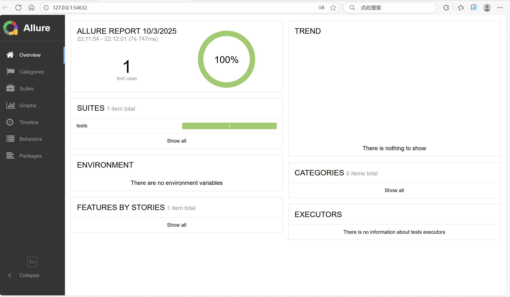
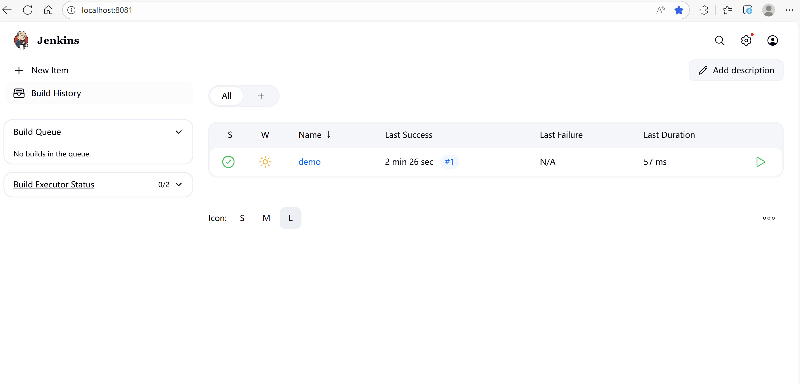
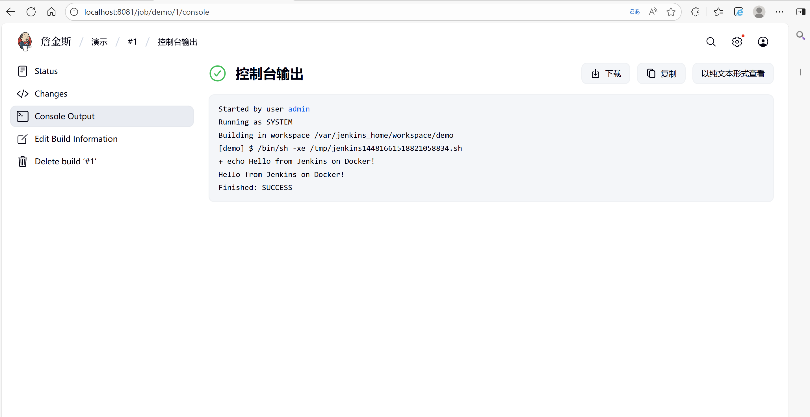

# MiniAutoTest - 接口+UI 自动化测试框架

&gt; 14 天自学成果 · 可直接运行 · 附 Allure 报告截图

---

## 🏁 项目概览
| 模块 | 技术栈 | 状态 |
| ---- | ------ | ---- |
| 接口测试 | `pytest` + `requests` + `allure` | ✅ 已完成 |
| UI 测试 | `Selenium` + `EdgeDriver` + `JS 注入` | ✅ 已完成 |
| 报告 | `Allure` 可视化 | ✅ 已完成 |

---

## 📸 运行截图
| 接口报告 | UI 报告 |
| -------- | ------- |
| 待补充 |  |

---

## 🚀 一键运行
```bash
# 1. 安装依赖
pip install -r requirements.txt

# 2. 运行接口测试
pytest tests/test_weather.py --alluredir report

# 3. 运行 UI 测试
pytest tests/test_ui_baidu.py --alluredir report

# 4. 查看报告
allure serve report 
## Day11 Jenkins CI


